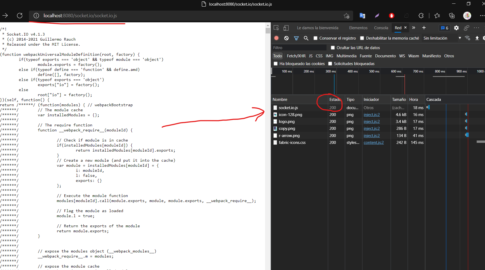

# <span style="color: #b5e7a0">Inicializando proyecto</span>
- Inicializar proyecto con package.json: ``` npm init -y```


# Socket.io

 <span style="color:green">Contexto: </span>Los servidores real time son muy utilizados para sistema de chat y de comentarios.

<span style="color:#c94c4c">¿Que es socket.io?</span><br>
 Es una librería open source que ayuda a construir aplicaciones con conexión persitente entre cliente y servidor. Esta herramienta permite crear comunicaciones en tiempo real entre cliente/servidor.


#  <span style="color:#b5e7a0">Seguimiento :</span>

- 1.-  <span style="color:#82b74b">Inicializando proyecto</span>
    - Configuraciones iniciales del proyecto
    - Creando repositorio local y en la nube
    - Instalando las librerías express, dotenv, cors y colors
    - Configurando el cdn de BOOTSTRAP

- 2.-  <span style="color:#82b74b">Creando el servidor de socket.io - Instalación de Socket.io</span>
    - Instalando el paquete de socket.io con npm
    - Modificando el archivo server para crear un servidor de web-sockets
        - Al arrancar nuevamente el servidor se requiere serciorarce de que socket.io ya se encuentra instalado en nuestro servidor, para ello se requiere ir al siguiente url: http://localhost:8080/socket.io/socket.io.js y se tiene que observar lo siguiente:
        - -> el url de socket.io
        - -> El código de la importación de socket.io
        - -> Código 200 de la petición http de la carga de el socket.io.js que se realiza desde el archivo index.html
    <p align="center">
        
    </p>

- 3.-  <span style="color:#82b74b">Configuración de socket.io - Front end</span>
    - Se agrega la función que conecta y desconecta la cmunicación de socket.io al recargar el servicio

- 4.-  <span style="color:#82b74b">Mensajes de conexión y desconexión - Cliente</span>
    - Se agrega en el index spna que contienen contenido el cual va a mostrar cuando se este conectado o desconectado
    - En socket-client.js (front-end) se agrega la funcionalidad que va ayudar a mostrar el mensaje que nos va a avisar si el clente esta conectado o desconectado


<span style="color:#c94c4c"></span>
